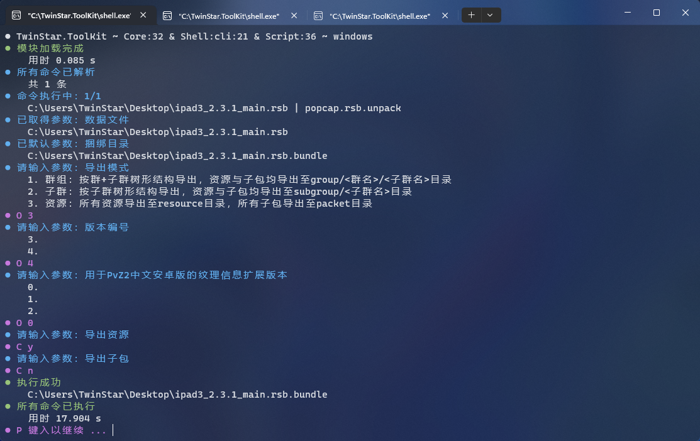
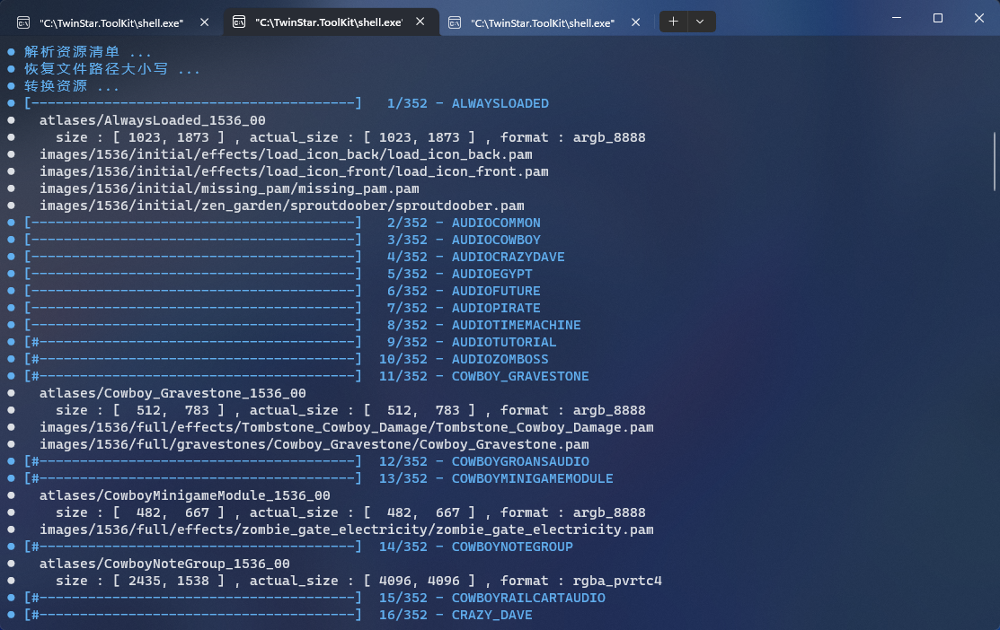
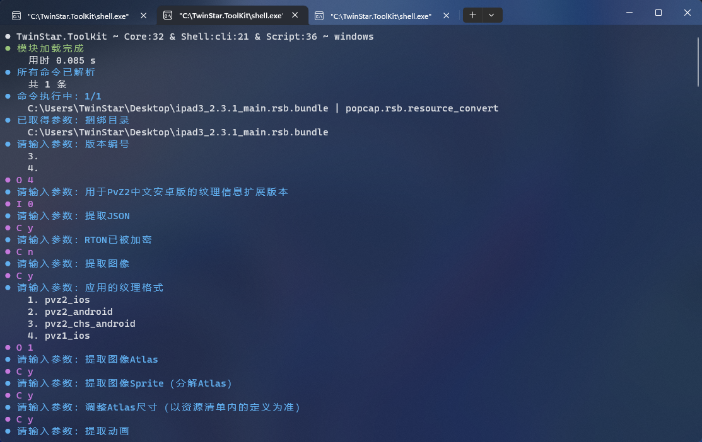
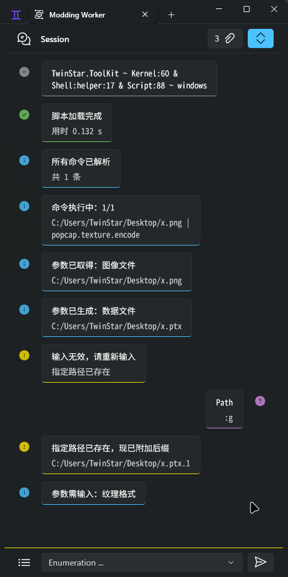
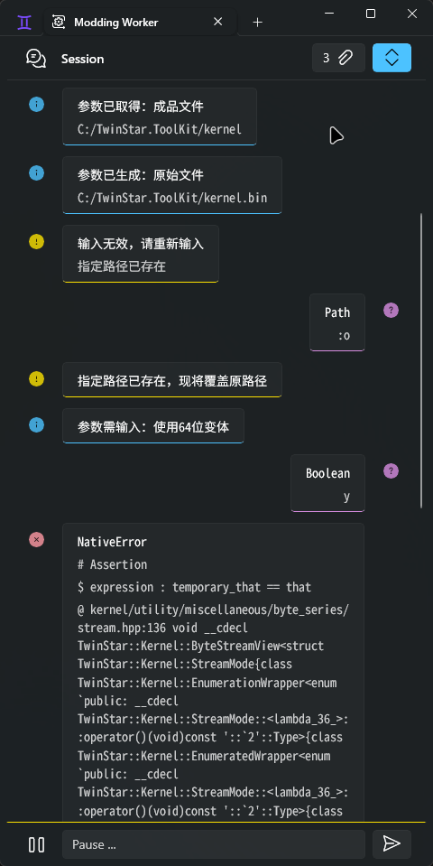
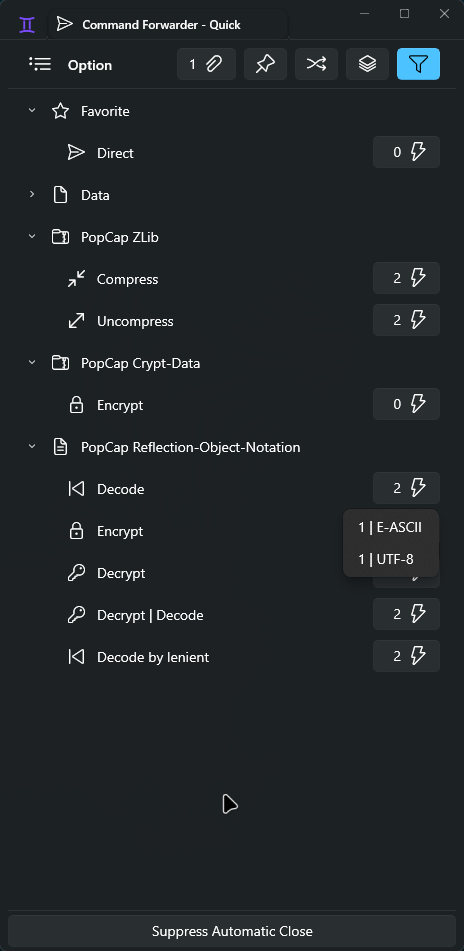

# TwinStar ToolKit - Document

TwinStar ToolKit 的说明文档。

TwinStar ToolKit Documentation.

> The English version is translated by [Haruma](https://github.com/Haruma-VN) .

## 文档列表 | document list

- [工具介绍](./chinese/introduction.md) | [Introduction](./english/introduction.md)

- [安装步骤](./chinese/installation.md) | [Installation](./english/installation.md)

- [基础使用](./chinese/usage.md) | [Usage](./english/usage.md)

* [功能列表](./chinese/method.md) | [Method](./english/method.md)

* [常见问题](./chinese/question.md) | [Question](./english/question.md)

- [高级应用](./chinese/advanced.md) | [Advanced](./english/advanced.md)

## 预览 | preview

* 使用简单且快速。\
  Fast and easy to use.
	
	
	
	
	
	
	
	

* 提供中文与英文支持。\
  Support Chinese and English.
	
	

* 提供 CLI 与 GUI 。\
  Provides the CLI and GUI.
	
	
	
	
	
	

* 适用于 Windows / Macintosh / Android 的系统集成。\
  System integration for Windows / Macintosh / Android .
	
	
	
	
	
	
