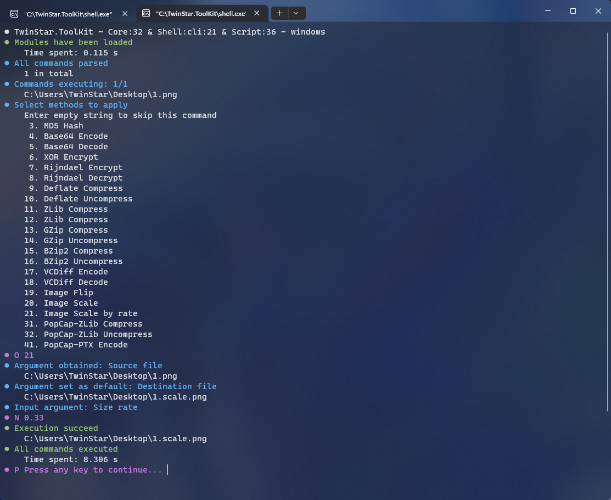
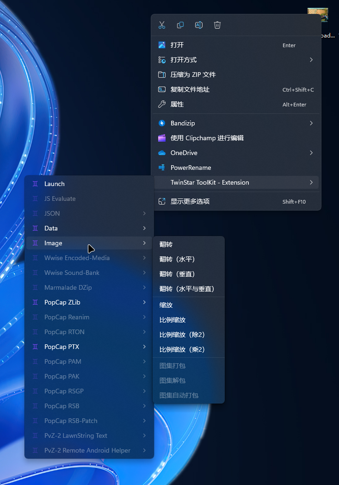

# TwinStar ToolKit - Document

TwinStar ToolKit 的说明文档。

> **开发本工具唯一的目的是打破阻碍 PvZ-2 MOD 创作的技术壁垒，它的服务对象是作者本人，它的追求与是“技术开放”这一独立于人的概念，而非某些个人或群体的利益。**
> 
> **尽管这是一款自由软件，但我主观上并不希望这一成果被那些我所看不起的群体利用。**

## 文档列表 | document list

* [介绍](./chinese/introduction.md)

* [安装](./chinese/installation.md)

* [使用](./chinese/usage.md)

## 预览 | preview

* **提供中文与英文支持。 Support Chinese and English.**
	
	

* **提供用于 Windows 的 Explorer 集成。 Explorer integration for Windows.**
	
	

* **为所有操作系统提供 GUI 支持。GUI support for any operation system.**
	
	

* **通过简单易用的 CLI 处理任意 PvZ-2 文件。 Process any PvZ-2 file by an easy CLI program.**
	
	
	
	
	
	
	
	
