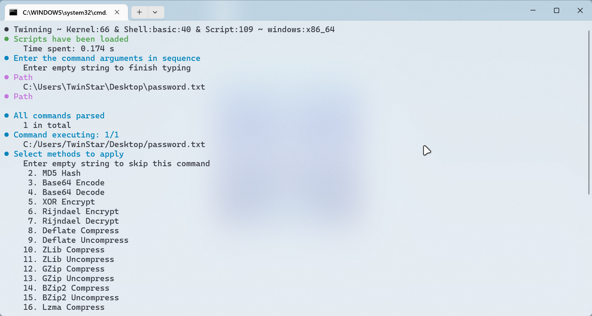
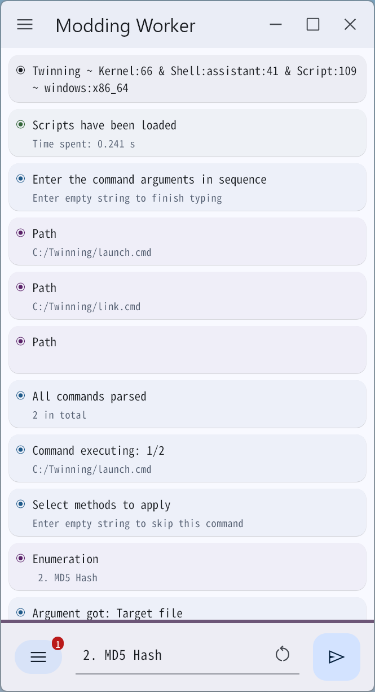
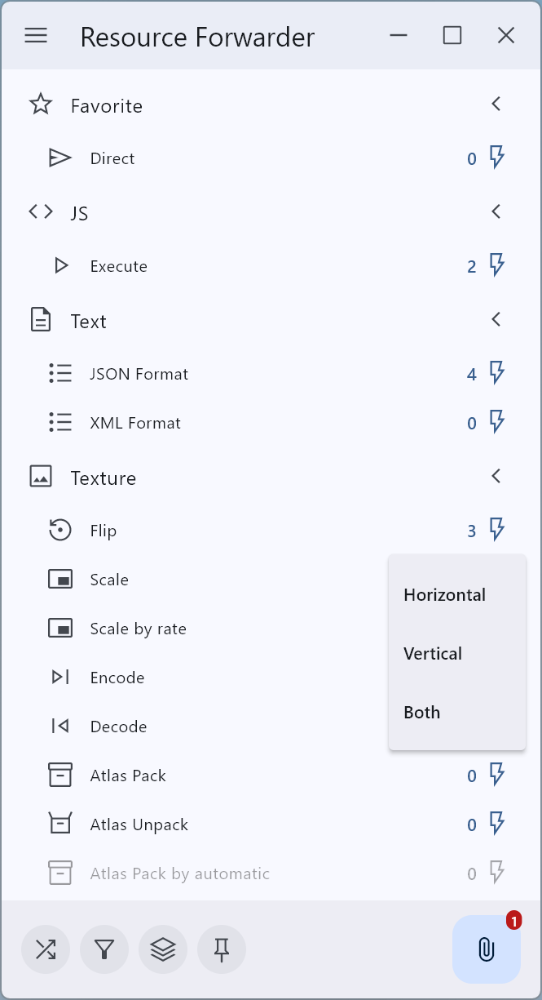
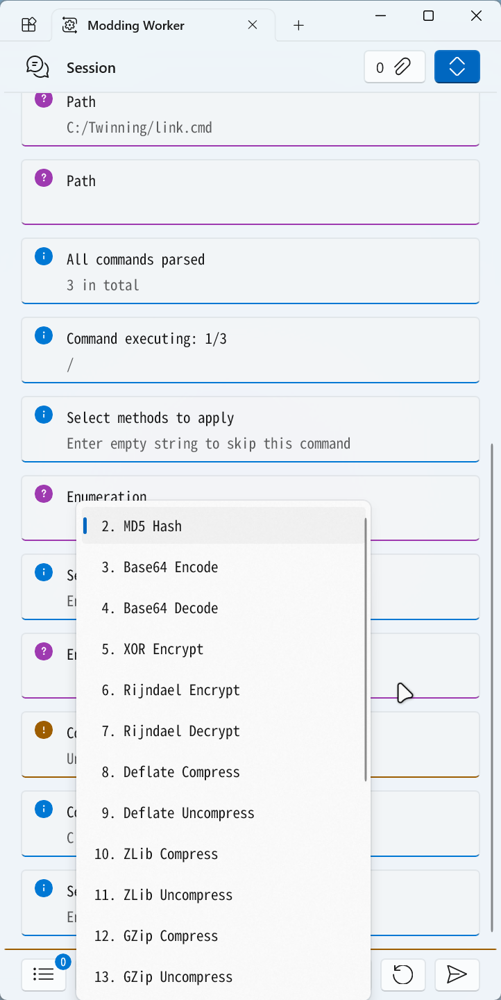
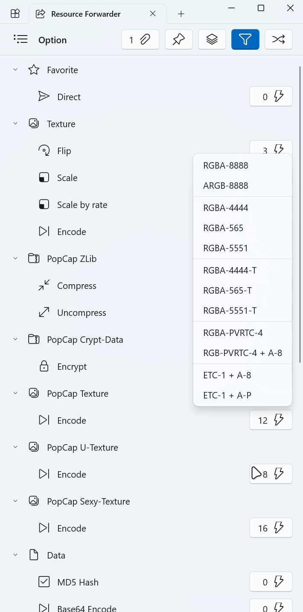
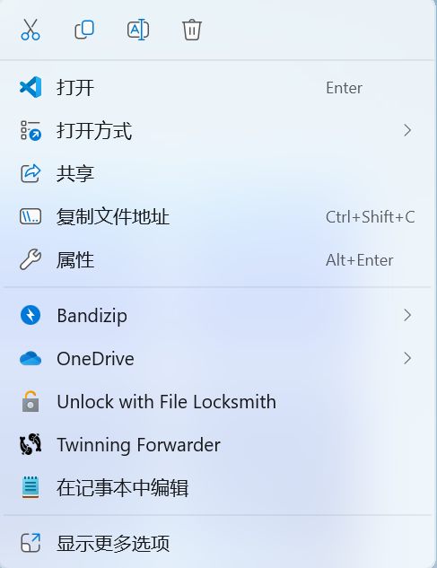

# Twinning - Documentation

 ***Toolbox for processing specific file format.***

> The English version is translated by [Haruma](https://github.com/Haruma-VN) .

## 文档列表 | document list

* [更新日志](./CHANGELOG.md)

* [工具介绍](./chinese/introduction.md) | [Introduction](./english/introduction.md)

* [安装步骤](./chinese/installation.md) | [Installation](./english/installation.md)

* [使用方法](./chinese/usage.md) | [Usage](./english/usage.md)

* [功能列表](./chinese/method.md) | [Method](./english/method.md)

* [常见问题](./chinese/question.md) | [Question](./english/question.md)

* [高级应用](./chinese/advanced.md) | [Advanced](./english/advanced.md)

## 预览 | preview

 

 

